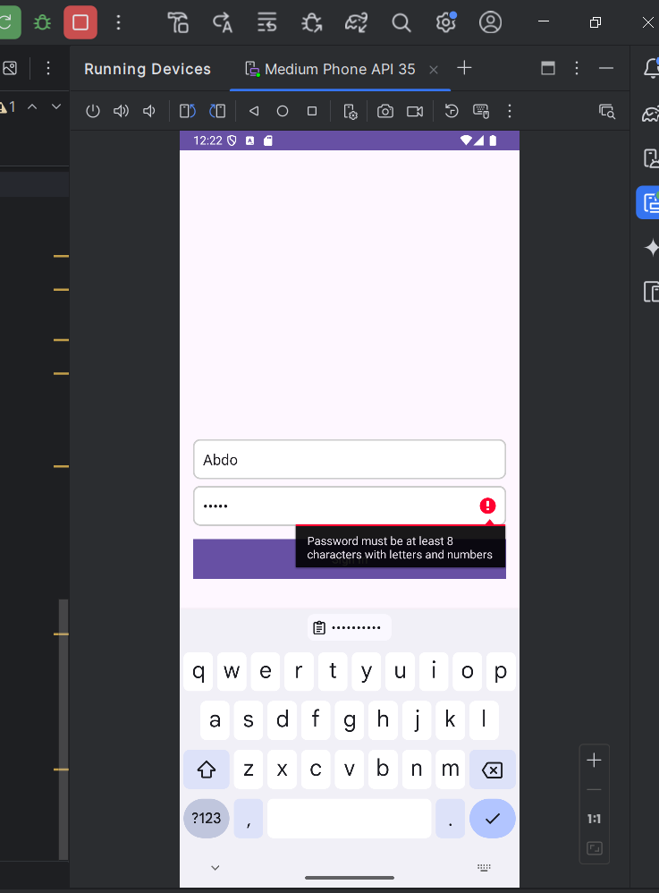
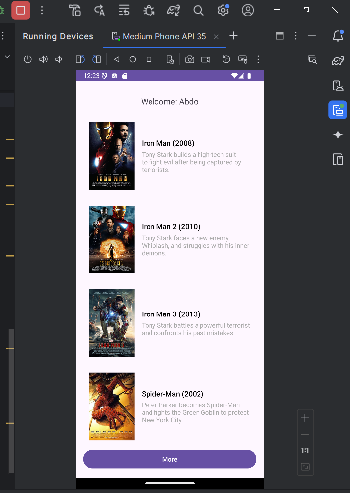
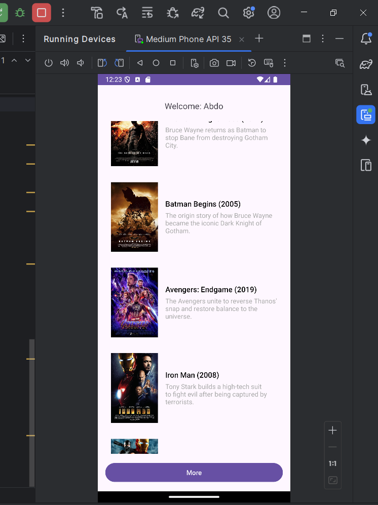
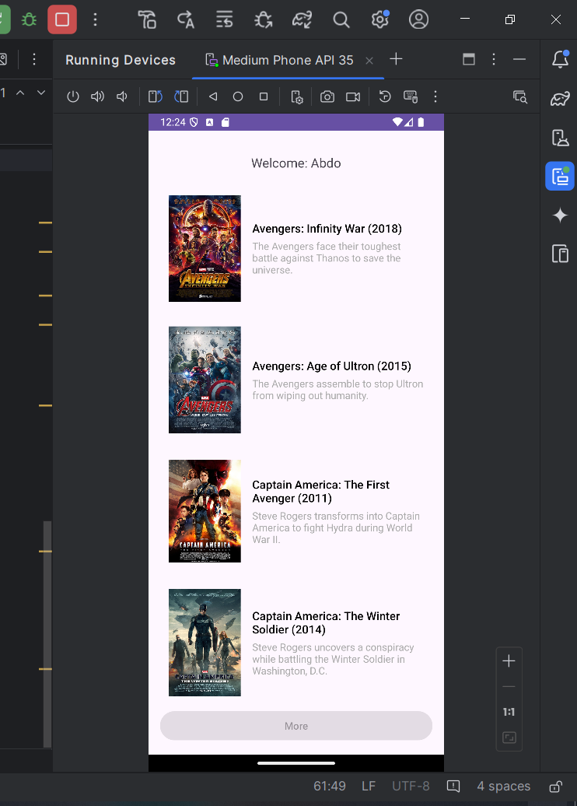

# Movie List App

This is a simple **Movie List App** built using **Kotlin** and **Android Studio**. The app displays a list of movies with their titles, descriptions, and images. Users can load more movies by clicking the "More" button.

## Features

1. **Sign-In Screen**:
   - Validates username and password.
   - Password requirements:
     - Not empty.
     - At least 8 characters.
     - Contains at least one number and one letter.
   - After successful sign-in, the app navigates to the **Movie List** screen, displaying the username.

2. **Movie List Screen**:
   - Displays an initial list of 5 movies (title, description, and image).
   - Clicking **"More"** adds 5 movies to the **top of the list**, up to a maximum of 15 movies.
   - Once 15 movies are loaded, the button becomes inactive with a Toast message: "No more movies to add!"
   - Movies include titles, descriptions, and corresponding images.

3. **Exit Behavior**:
   - Clicking the back button closes the app instead of returning to the sign-in screen.

## Screenshots

### 1. Sign-In Screen

### 2. Movie List Screen

### 3. Load More Button Clicked

### 4. Load More Button Clicked and Button Disabled

